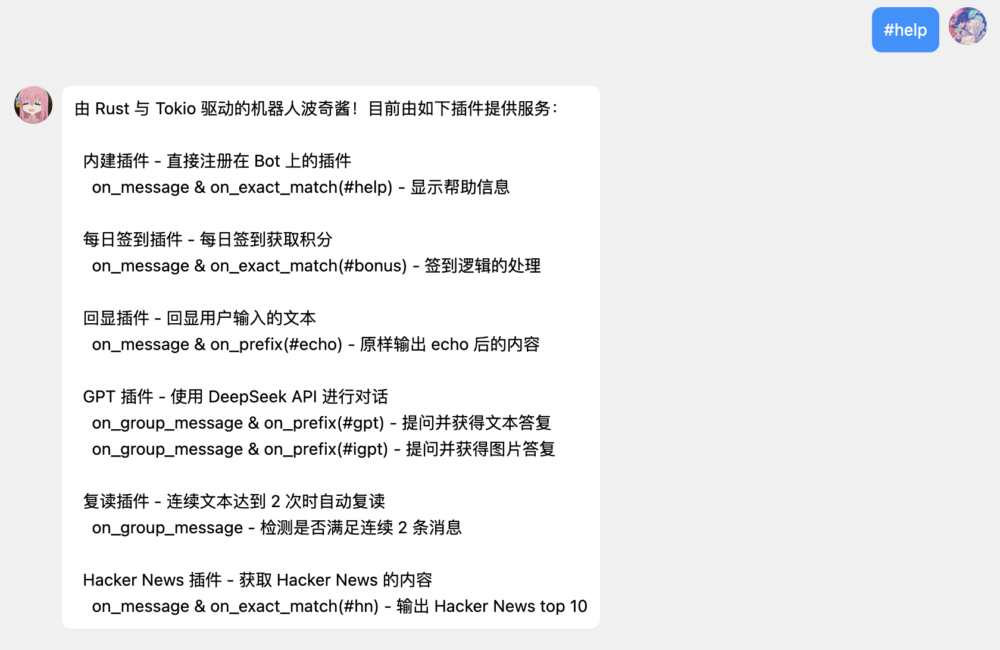

<h1 align="center">- bocchi -</h1>

<p align="center">
    
</p>

> [!CAUTION]
> 机器人账号被藤子拿下多次，暂时停更。

## 简介
> [!IMPORTANT]
> 项目仍处于开发阶段，API 可能会在未通知的情况下发生变化。
>
> 当前仅支持正向 WebSocket 连接，实现了 OneBot 11 协议的部分功能。

波奇酱是一个由 Rust 与 Tokio 驱动的纯异步 OneBot 11 客户端实现。

## 特性

+ 异步 I/O，性能优异；
+ 占用资源少，内存友好；
+ 结构简单、用法符合直觉；
+ 支持插件机制，方便扩展。


## 用法
```rust
#[tokio::main]
async fn main() -> Result<()> {
    let mut bot_instance = Bot::connect("ws://192.168.1.250:3001").await?;
    bot_instance.register_plugin(plugin::echo_plugin());
    bot_instance.start().await
}
```

## 结构

本项目分为两个模块：

- `bocchi`：波奇酱的核心实现，提供了 OneBot 11 协议的功能子集；
- `bocchi_bot`：依赖 `bocchi` 的机器人实现，包含若干插件，可作为实现参考。


## 截图


